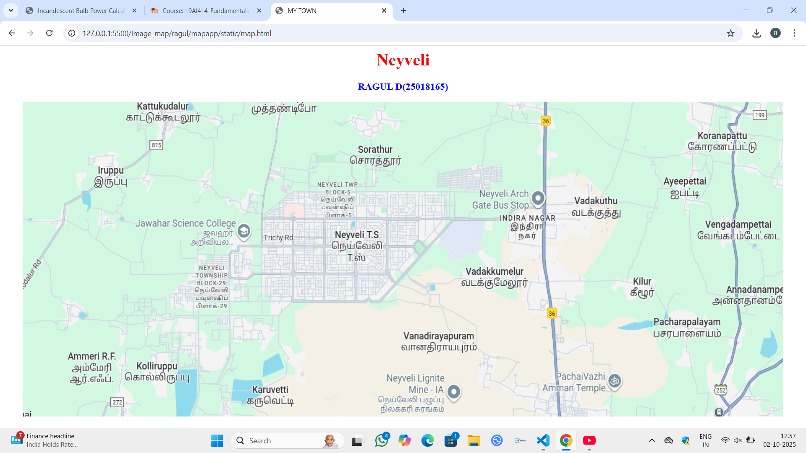
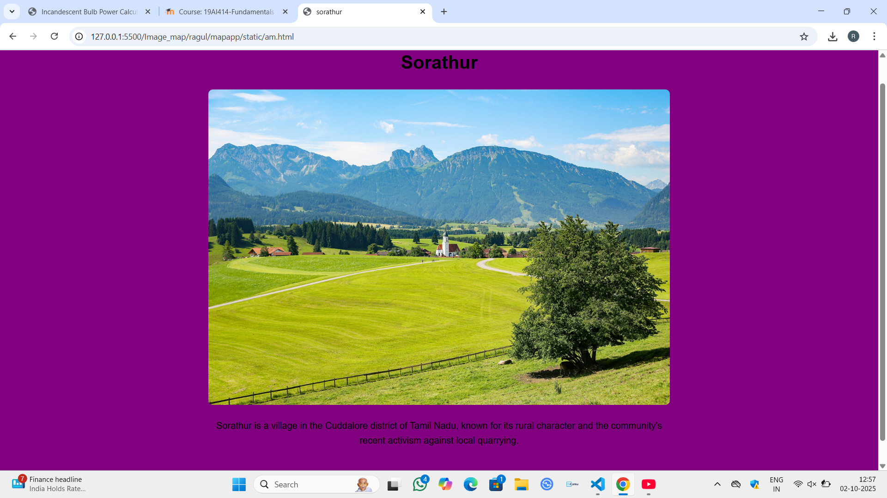
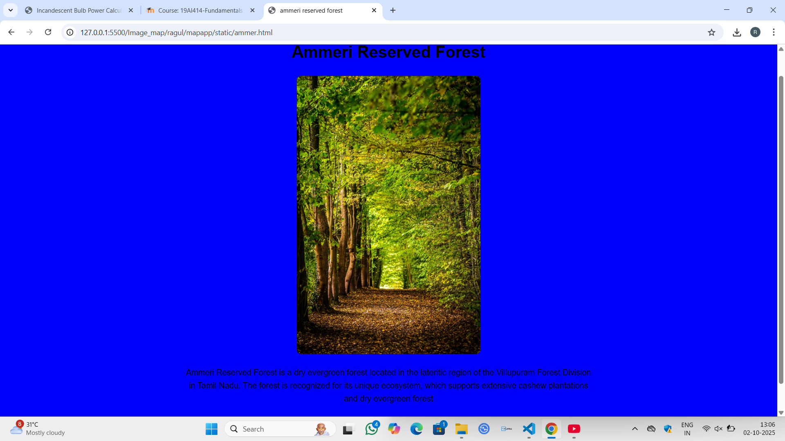
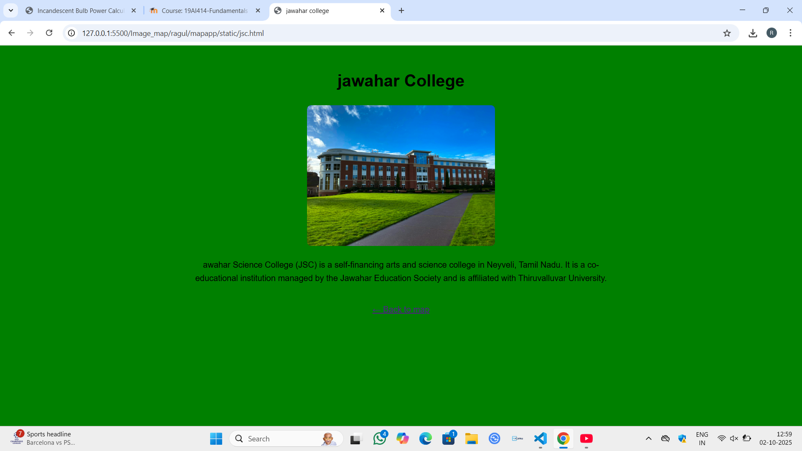
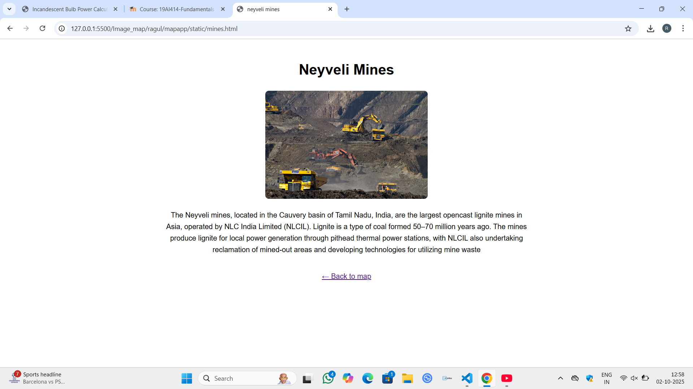
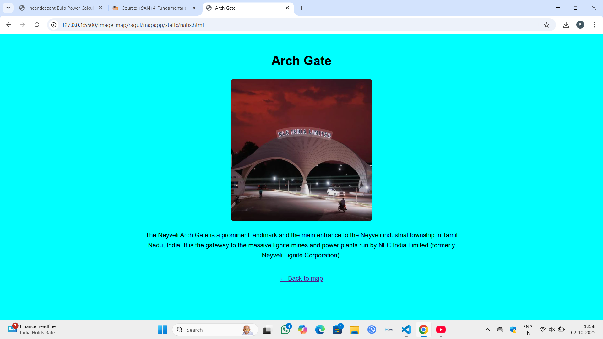

# Ex04 Places Around Me
# Date:01.10.2025
# AIM
To develop a website to display details about the places around my house.

# DESIGN STEPS
## STEP 1
Create a Django admin interface.

## STEP 2
Download your city map from Google.

## STEP 3
Using <map> tag name the map.

## STEP 4
Create clickable regions in the image using <area> tag.

## STEP 5
Write HTML programs for all the regions identified.

## STEP 6
Execute the programs and publish them.

# CODE
```
map.html
<html>
    <head>
        <title>
            MY TOWN
        </title>
    </head>
    <body>
        <h1 align="center">
            <font color="red"><b>Neyveli</b></font>
        </h1>
        <h3 align="center">
            <font color="blue"><b>RAGUL D(25018165)</b></font>
        </h3>
        <center>
            
            <map name="#MyTown">
        <area shape="rect" coords="480,262,410,215"href="jsc.html" title="jawahar college"alt="jawahar College">
        <area shape="rect" coords="899,560,813,506 " href="mines.html" title="neyveli mines" alt="Neyveli Mines">
        <area shape="rect" coords="985,230,1071,151" href="nabs.html" title="arch gate" alt="Arch Gate">
        <area shape="rect" coords="766,60,652,131" href="am.html" title="sorathur" alt="Sorathur">
        <area shape="rect" coords="192,448,82,533" href="ammer.html" title="ammeri reserved forest" alt="Ammeri Reserved Forest">

            </map>
        </center>
    </body>
</html>

am.html

<!doctype html>
<html lang="en">
<head>
  <meta charset="utf-8">
  <title>sorathur</title>
  <meta name="viewport" content="width=device-width,initial-scale=1">
  <style>
    body { font-family: Arial, sans-serif; line-height:1.6; padding:20px; max-width:800px; margin:auto; }
    img { max-width:100%; height:auto; border-radius:8px; }
    .back { margin-top:18px; display:inline-block; }
  </style>
</head>
<body bgcolor="purple">
  <center><h1>Sorathur</h1>

 
  

  <p>
    Sorathur is a village in the Cuddalore district of Tamil Nadu, known for its rural character and the community's recent activism against local quarrying.
    
  </p>

  <a class="back" href="map.html">&larr; Back to map</a>
  </center>
</body>
</html>

ammer.html
<!doctype html>
<html lang="en">
<head>
  <meta charset="utf-8">
  <title>ammeri reserved forest</title>
  <meta name="viewport" content="width=device-width,initial-scale=1">
  <style>
    body { font-family: Arial, sans-serif; line-height:1.6; padding:20px; max-width:800px; margin:auto; }
    img { max-width:50%; height:auto; border-radius:8px; }
    .back { margin-top:18px; display:inline-block; }
  </style>
</head>
<body bgcolor="purple">
  <center><h1>Ammeri Reserved Forest</h1>

 
  

  <p>
   Ammeri Reserved Forest is a dry evergreen forest located in the lateritic region of the Villupuram Forest Division in Tamil Nadu. The forest is recognized for its unique ecosystem, which supports extensive cashew plantations and dry evergreen forest


    
  </p>

  <a class="back" href="map.html">&larr; Back to map</a>
  </center>
</body>
</html>

jsc.html

<!doctype html>
<html lang="en">
<head>
  <meta charset="utf-8">
  <title>jawahar college</title>
  <meta name="viewport" content="width=device-width,initial-scale=1">
  <style>
    body { font-family: Arial, sans-serif; line-height:1.6; padding:20px; max-width:800px; margin:auto; }
    img { max-width:45%; height:auto; border-radius:8px; }
    .back { margin-top:18px; display:inline-block; }
  </style>
</head>
<body bgcolor="green">
  <center><h1>jawahar College</h1>

 
  

  <p>
     awahar Science College (JSC) is a self-financing arts and science college in Neyveli, Tamil Nadu. It is a co-educational institution managed by the Jawahar Education Society and is affiliated with Thiruvalluvar University.
  </p>

  <a class="back" href="map.html">&larr; Back to map</a>
  </center>
</body>
</html>

mines.html
<!doctype html>
<html lang="en">
<head>
  <meta charset="utf-8">
  <title>neyveli mines</title>
  <meta name="viewport" content="width=device-width,initial-scale=1">
  <style>
    body { font-family: Arial, sans-serif; line-height:1.6; padding:20px; max-width:800px; margin:auto; }
    img { max-width:45%; height:auto; border-radius:8px; }
    .back { margin-top:18px; display:inline-block; }
  </style>
</head>
<body bgcolor="white">
  <center><h1>Neyveli Mines</h1>

 
  

  <p>
     The Neyveli mines, located in the Cauvery basin of Tamil Nadu, India, are the largest opencast lignite mines in Asia, operated by NLC India Limited (NLCIL). Lignite is a type of coal formed 50–70 million years ago. The mines produce lignite for local power generation through pithead thermal power stations, with NLCIL also undertaking reclamation of mined-out areas and developing technologies for utilizing mine waste
  </p>

  <a class="back" href="map.html">&larr; Back to map</a>
  </center>
</body>
</html>

nabs.html
 !doctype html>
<html lang="en">
<head>
  <meta charset="utf-8">
  <title>Arch Gate</title>
  <meta name="viewport" content="width=device-width,initial-scale=1">
  <style>
    body { font-family: Arial, sans-serif; line-height:1.6; padding:20px; max-width:800px; margin:auto; }
    img { max-width:45%; height:auto; border-radius:8px; }
    .back { margin-top:18px; display:inline-block; }
  </style>
</head>
<body bgcolor="cyan">
  <center><h1>Arch Gate</h1>

 
  

  <p>
     The Neyveli Arch Gate is a prominent landmark and the main entrance to the Neyveli industrial township in Tamil Nadu, India. It is the gateway to the massive lignite mines and power plants run by NLC India Limited (formerly Neyveli Lignite Corporation). 
  </p>

  <a class="back" href="map.html">&larr; Back to map</a>
  </center>
</body>
</html>
```

# Output








# RESULT
The program for implementing image maps using HTML is executed successfully.
